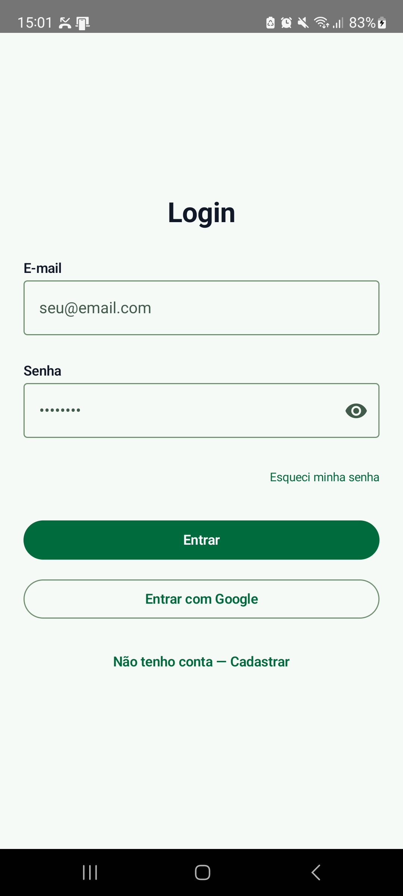
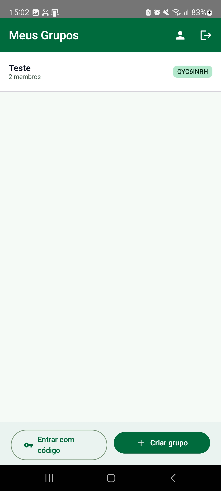
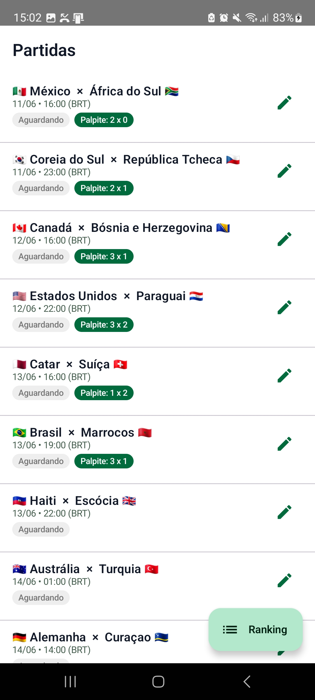
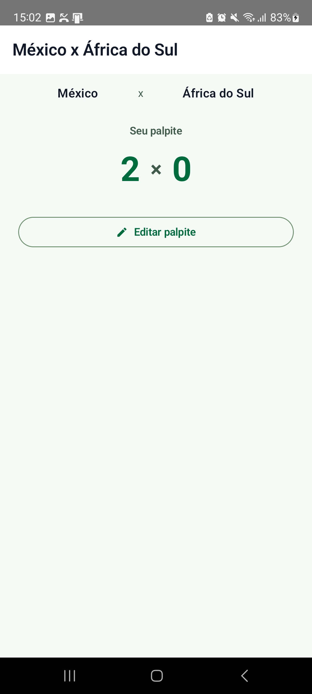
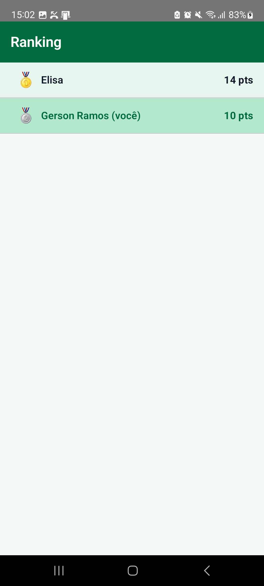

# Bolão Copa 2026

Aplicativo Android para bolões da Copa do Mundo FIFA 2026. Crie grupos com amigos, faça seus palpites antes de cada partida e acompanhe o ranking em tempo real.

---

## Telas

<p align="center">
  
  &nbsp;&nbsp;
  
  &nbsp;&nbsp;
  
  &nbsp;&nbsp;
  
  &nbsp;&nbsp;
  
</p>

<p align="center">
  <em>Login &nbsp;·&nbsp; Grupos &nbsp;·&nbsp; Partidas &nbsp;·&nbsp; Palpite &nbsp;·&nbsp; Ranking</em>
</p>

---

## Funcionalidades

- **Autenticação** — login com e-mail/senha ou conta Google
- **Grupos** — crie um grupo, compartilhe o código de convite e chame seus amigos
- **Palpites** — aposte o placar de cada partida antes do prazo fechar
- **Pontuação automática** — calculada via Cloud Functions assim que o jogo termina
- **Ranking em tempo real** — atualizado após cada resultado
- **Visualização de palpites** — veja os palpites dos outros membros após o prazo e as pontuações individuais ao fim da partida
- **Plano freemium** — 1 grupo gratuito; VIP (pagamento único) para grupos ilimitados

### Sistema de pontuação padrão

| Acerto | Pontos |
|--------|--------|
| Placar exato | 10 |
| Vencedor + gols do vencedor | 7 |
| Vencedor + gols do perdedor | 5 |
| Empate correto | 4 |
| Só o vencedor | 2 |
| Nenhum acerto | 0 |

> A pontuação de cada grupo pode ser personalizada pelo administrador na criação.

---

## Tecnologias

**Android**
- Kotlin · Jetpack Compose · Material 3
- Hilt (injeção de dependência)
- Firebase Auth · Firestore · Cloud Functions
- Arquitetura modular (core/domain, core/data, core/ui, feature/*)

**Backend (Firebase Cloud Functions)**
- TypeScript · Node.js
- Integração com [football-data.org](https://www.football-data.org) para resultados em tempo real
- Cálculo de pontuação com `FieldValue.increment` para otimização de custo

---

## Como rodar localmente

### Pré-requisitos

- Android Studio Hedgehog ou superior
- JDK 17+
- Conta no [Firebase](https://firebase.google.com) com projeto configurado
- Arquivo `google-services.json` na pasta `app/`

### Configuração

```bash
# Clone o repositório
git clone <url-do-repo>
cd Bolao_copa_2026

# Coloque o google-services.json em app/
# (Firebase Console → Configurações do projeto → Baixar google-services.json)

# Abra no Android Studio e execute o app
```

### Cloud Functions (opcional para desenvolvimento)

```bash
cd functions
npm install

# Criar functions/.env com:
# FOOTBALL_DATA_TOKEN=seu_token_aqui

npm run build
firebase deploy --only functions
```

---

## Contato

Dúvidas ou sugestões: **gersonlopesr@gmail.com**
